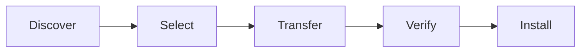

# illustrator-full-version-manager 🎨🗂️

  

*A calm, dependable manager for tracking down, organizing, and launching your Adobe Illustrator full version download — built for teams who value stability over guesswork.*

---

## 🧭 Overview

**illustrator-full-version-manager** exists because "just download Illustrator" has quietly become a surprisingly fragile sentence. Between shifting CDN endpoints, regional mirrors, version fragmentation across Creative Cloud releases, and the sheer noise of unofficial sources, finding a clean path to a legitimate Adobe Illustrator full version download is harder than it should be for designers, studios, and IT administrators alike. This project is a single, opinionated front door: a lightweight desktop companion that indexes known-good distribution points, verifies package integrity, and gives you a predictable, repeatable way to obtain and manage Illustrator builds without babysitting five browser tabs.

The tool was born out of a recurring pattern we kept seeing on support tickets and in creative-ops Slack channels: someone needs Illustrator on a fresh machine *today*, the usual link is dead or geo-blocked, and nobody wants to spend an afternoon reverse-engineering which version their plugins actually support. So we built a manager that treats "getting Illustrator" as an engineering problem — with versioning, checksums, and a UI — rather than a scavenger hunt.

Who this is for: freelance designers rebuilding a workstation, agencies standardizing Illustrator across a fleet of machines, IT teams that need auditable version records, and hobbyists who just want the current release without wading through forum threads. If you've ever typed "adobe illustrator full version download" into a search bar and felt a small wave of dread, this project is aimed squarely at you.

<blockquote>

We treat reliability as a feature, not an afterthought. Every release of this manager is tested against a matrix of Windows configurations before it ships.

</blockquote>

  

---

## 🏛️ Capabilities That Actually Hold Up Under Use

- **Version ledger, not a link dump.** Rather than a static list of URLs, the manager keeps a structured record of which Illustrator builds it has seen, when, and from where — so "which version am I even getting" stops being a mystery.

- **Integrity-first fetching.** Every package is checksum-verified before it's marked as ready, so a partial or tampered download never masquerades as a finished one.

- **Resumable, patient downloading.** Network drops on a 2GB+ installer are treated as expected, not exceptional — the manager picks up where it left off instead of forcing a restart.

- **Mirror awareness.** When a primary distribution point slows down or times out, the manager quietly reroutes to a healthier path instead of leaving you staring at a stalled progress bar.

- **Offline-friendly install cache.** Once a full version download completes, it stays cached locally so re-imaging a machine doesn't mean re-downloading gigabytes from scratch.

- **Zero background noise.** No telemetry daemons, no silent auto-launch on boot — the tool runs when you open it and stops when you close it.

- **Audit-friendly logging.** Every fetch, verification, and install action is timestamped in a local log, which matters a lot more than people expect once IT asks "what version is on machine 14."

- **Portable-first design.** No installer wizard required for the manager itself — drop the executable where you want it and run it.

---

## 🚀 How to Get Started

> [!TIP]
> The whole flow is designed to take less time than reading this README section did.

1. Open the landing page via the download button above or below.

2. Grab the latest build for Windows — no account, no subscription gate.

3. Run the executable directly; there's no multi-screen installer to click through.

4. Use the in-app catalog to select your target Illustrator version and start the managed download.

---

## 🖥️ System Requirements

| Requirement | Details |
|---|---|
| OS | Windows 10 (64-bit) or Windows 11 |
| Dependencies | None — fully standalone, no runtime installs required |
| Disk space | 4 GB free minimum, 10+ GB recommended for cached installers |
| Memory | 4 GB RAM minimum, 8 GB recommended |
| Network | Broadband connection for the initial full version download |
| Permissions | Standard user account; admin rights only needed for final Illustrator install |

> [!NOTE]
> Because the manager is standalone, it does not modify system PATH variables or register background services. Uninstalling is as simple as deleting the folder.

---

## ⚙️ How It Works

The architecture is intentionally boring in the best sense — boring means predictable, and predictable is what you want when the end goal is a working creative tool, not a science project.

1. **Discovery** — the manager queries its curated index of Illustrator distribution points relevant to your selected version.

2. **Selection** — you pick the version and edition that matches your workflow and plugin compatibility needs.

3. **Transfer** — the download begins with resumable chunking, so interruptions don't cost you progress.

4. **Verification** — a checksum pass confirms the package matches the expected signature before anything is unlocked for install.

5. **Handoff** — the verified installer is handed to Windows' native installer flow, which you run like any other application setup.

> [!IMPORTANT]
> The manager never modifies the Illustrator installer itself. It fetches, verifies, and hands off — the actual installation is performed by Adobe's own setup process, keeping the chain of trust intact.

---

## 🩺 Troubleshooting

<strong>The download stalls at a fixed percentage and never moves.</strong>

This is almost always a mirror-level slowdown rather than a manager bug. Pause the transfer and resume it — the tool will re-evaluate available mirrors and typically picks a faster path automatically.

<strong>Illustrator installs but plugins from an older version stop working.</strong>

Plugin compatibility is tied to the specific Illustrator build, not just "the latest version." Check the version ledger in the manager to confirm exactly which build you installed, then cross-reference your plugin vendor's supported-version list.

<strong>Windows SmartScreen flags the manager on first run.</strong>

This is standard behavior for newer, unsigned-at-scale executables rather than an indicator of a problem. Click "More info" and confirm you trust the source, or verify the checksum published on the landing page yourself before proceeding.

<strong>The checksum verification fails after a full download.</strong>

Delete the cached partial file and re-run the download rather than retrying the verification alone — a corrupted chunk earlier in the transfer is the usual root cause, and a clean re-fetch resolves it in the vast majority of cases.

<strong>Can I use this to manage multiple Illustrator versions side by side?</strong>

Yes — the version ledger is specifically built to track multiple cached builds so you can maintain, say, a current release and a legacy version for plugin testing without conflicts.

---

## ⌨️ UI, UX & Keyboard Shortcuts

The interface follows a "dashboard, not wizard" philosophy — everything you need is visible on one screen, with keyboard shortcuts for the actions you'll repeat most.

| Shortcut | Action |
|---|---|
| `Ctrl + N` | Start a new version download |
| `Ctrl + P` | Pause / resume active transfer |
| `Ctrl + R` | Re-run checksum verification |
| `Ctrl + L` | Open activity log |
| `Ctrl + K` | Open the version catalog search |
| `Ctrl + ,` | Open settings |
| `Ctrl + Shift + T` | Toggle light / dark theme |
| `F5` | Refresh mirror status |
| `Esc` | Cancel current dialog |

> [!TIP]
> Settings persist locally in a lightweight config file — no cloud account, no sync service, just a plain settings file you can back up manually if you'd like.

Theming ships with a light mode tuned for bright studio monitors and a dark mode tuned for late-night deadline sessions, both meeting standard contrast guidelines for extended readability.

---

## 🤝 Contributing & Community

  

We maintain this project the way we'd want a piece of studio infrastructure maintained: reviewed changes, clear commit history, and no surprise behavior changes between releases.

- Open an issue for mirror problems, checksum mismatches, or UI rough edges you encounter.

- Pull requests are welcome — please describe the *why* behind a change, not just the *what*, in the description.

- Discussion threads are the right place for workflow questions or feature proposals before they become issues.

> [!WARNING]
> Please don't open issues requesting help obtaining unauthorized or unlicensed software distributions. This project supports legitimate, above-board access to Illustrator full version downloads only.

---

## 📜 License

Released under the [MIT License](LICENSE), 2026. Use it, fork it, adapt it for your own studio's tooling — just keep the license notice intact.

---

## ⚠️ Disclaimer

This project is an independent, community-maintained utility and is not affiliated with, endorsed by, or sponsored by Adobe Inc. "Illustrator" and related marks belong to their respective owner. This manager is a discovery-and-transfer tool for obtaining legitimate Adobe Illustrator full version downloads; it does not host, modify, or alter Adobe's software in any way. Users are responsible for ensuring their use of Illustrator complies with Adobe's own licensing terms.

  

